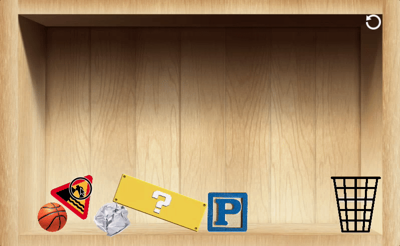
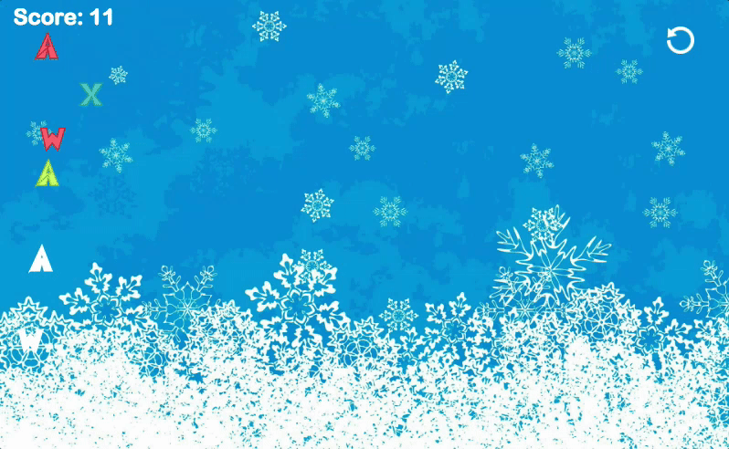

# **Phi-Syx**

## **[Live Weblink](http://bo0mero0.github.io/Phi-Syx)**

## **Background**

  Phi-Syx is an interactive game with multiple rounds each with a unique concept. The overall purpose is to demonstrate the realistic interactions between objects with other object and the world that they are in. Each round have their own winning conditions and is simple and easy to get the hang of. Most rounds' user interaction comes from use of drag and drop type play, with exceptions with use of keyboard input. Even the stage selection is an unique experience with orbs representing the rounds and user place them inside the designated area to start that round.

## **Game Basics**

### **Round Selection**
  

### **Object Interaction Rounds**
  

### **Slingshot Rounds**
  

### **Typing Challenge Rounds**
  
